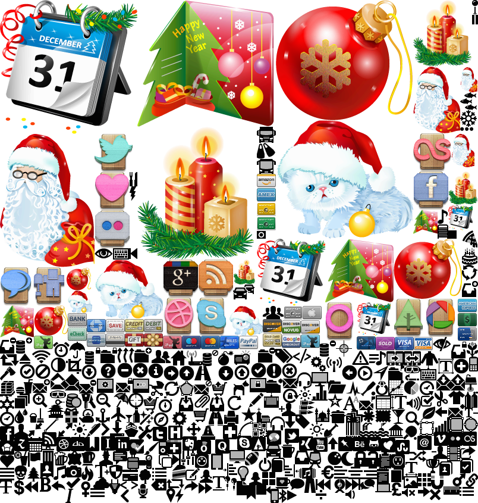

About imgcssmap
===============

Is a tool designed for web pages. It merges all icons image in only one
big image. This improve load time of web pages loading only one resource
im place oif loading many icons. The tool builds a css map of this icons.
The css map is build with templates.

[Original project page](https://www.arpalert.org/imgcssmap.html)

Note: project like fontawesome uses font files to implement same concept.

This is the resulting image:



This is a css map example:

```
[...]
span.i0 { /* 0: test_images/plastic_new_year/256/calendar.png */
   background:url(a.png) no-repeat -0px -0px;
   height:225px;
   width:231px;
   color:transparent;
   display:inline-block;
   border: #0000ff 1px solid;
}
span.i1 { /* 1: test_images/plastic_new_year/256/christmas_card.png */
   background:url(a.png) no-repeat -231px -0px;
   height:213px;
   width:233px;
   color:transparent;
   display:inline-block;
   border: #0000ff 1px solid;
}
[...]
```

[And this is the exemple page](https://www.arpalert.org/imgcssmap_example.html)

Build
=====

The tool need libpng and libjpeg. just type `make` for building the project.

Command line help
=================

```
imgcssmap [-t in_file out_file [-t in out [...]]] [-q 1-6] [-i] [-na rrggbb]
          [-c] -o output_image input_file [...]

   -t in_file out_file   in_file containing the template (typically CSS)
                         out_file file generated by the template
   -q 1-6                quality of colours. 6 is 8 bits per chanel quality
                         5 is 7 bits, 4 is 6 bits, 3 is 5 bits, 2 is 4 bits
                         and 1 is 3 bits
   -na rrggbb            remove alpha channel and replace it by the rrggbb
                         rrggbb is hexadecimal representation of the color
   -i                    interlace png output image
   -c                    crop unused alpha space into input file
   -o output_image       image builded

the template may contain this variables:
   $(width)   the image width
   $(height)  the image height
   $(offsetx) the x offset of the image
   $(offsety) the y offset of the image
   $(name)    the image name without extension
   $(azname)  the name only with this characters: 'a'-'z' '0'-'9' '_'
   $(id)      the index after sorting. first image is 0.
```
